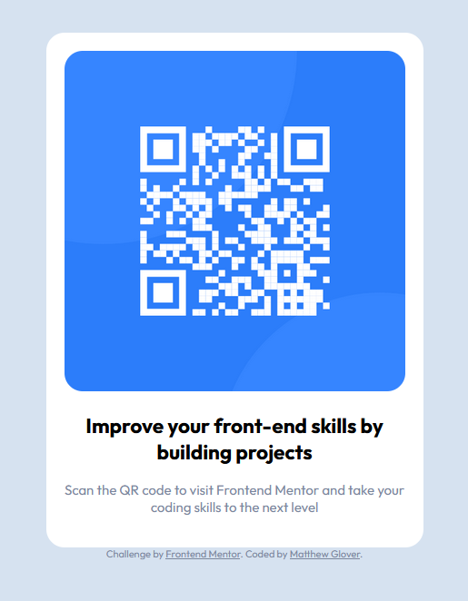

# Matthew Glover - Frontend Mentor - QR code component Project 1 solution

This is a solution to the [QR code component challenge on Frontend Mentor](https://www.frontendmentor.io/challenges/qr-code-component-iux_sIO_H).

## Table of contents

- [Overview](#overview)
  - [Screenshot](#screenshot)
  - [Links](#links)
  - [Built with](#built-with)
  - [What I learned](#what-i-learned)
- [Author](#author)

## Overview

### Screenshot

### Links

- Solution URL: (https://www.frontendmentor.io/solutions/qr-code-component-J094LKCO9W)
- Live Site URL: (https://matthew-glover.github.io/qr-code-project-1/)

### Built with

- HTML5
- CSS3

### What I learned

Through creating and publishing this project, I mainly learned how to navigate and use GitHub to host my projects from this point on.
Although I feel confident in HTML and CSS, I still do not feel completely confident in JavaScript and I am making sure to include that on all future projects for practice.

## Author

- Website - [Matthew Glover](https://github.com/matthew-glover)
- Frontend Mentor - [@matthew-glover](https://www.frontendmentor.io/profile/matthew-glover)